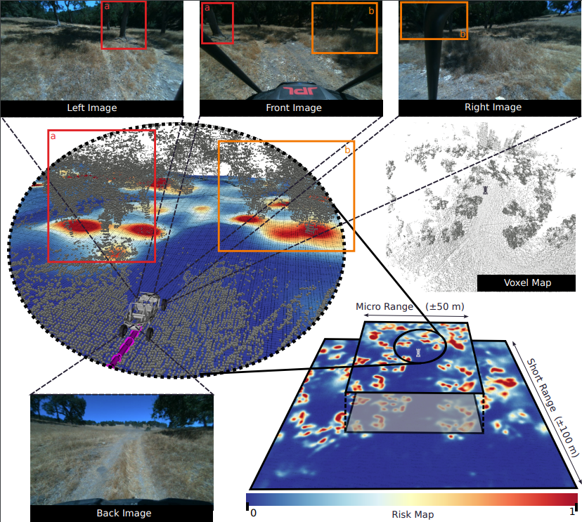
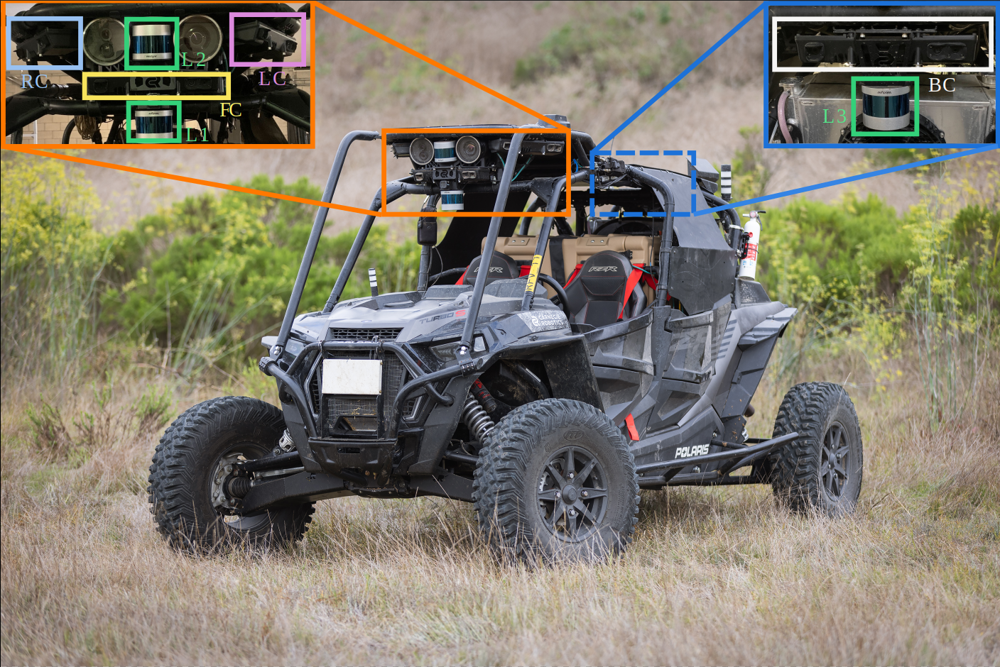
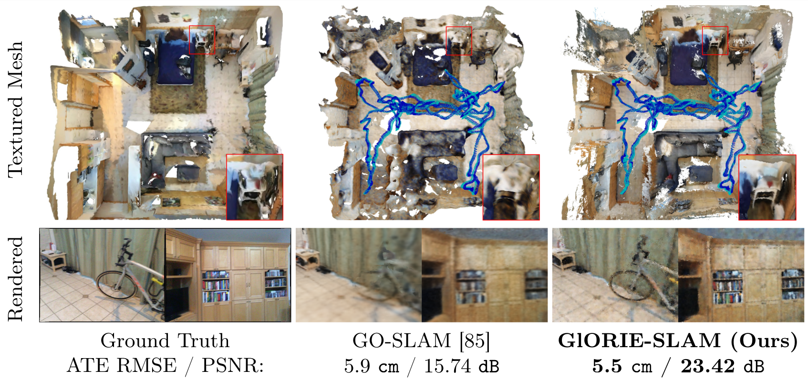
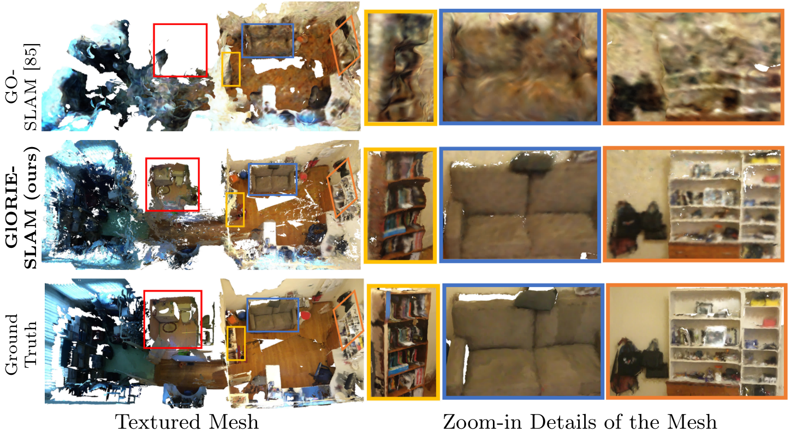
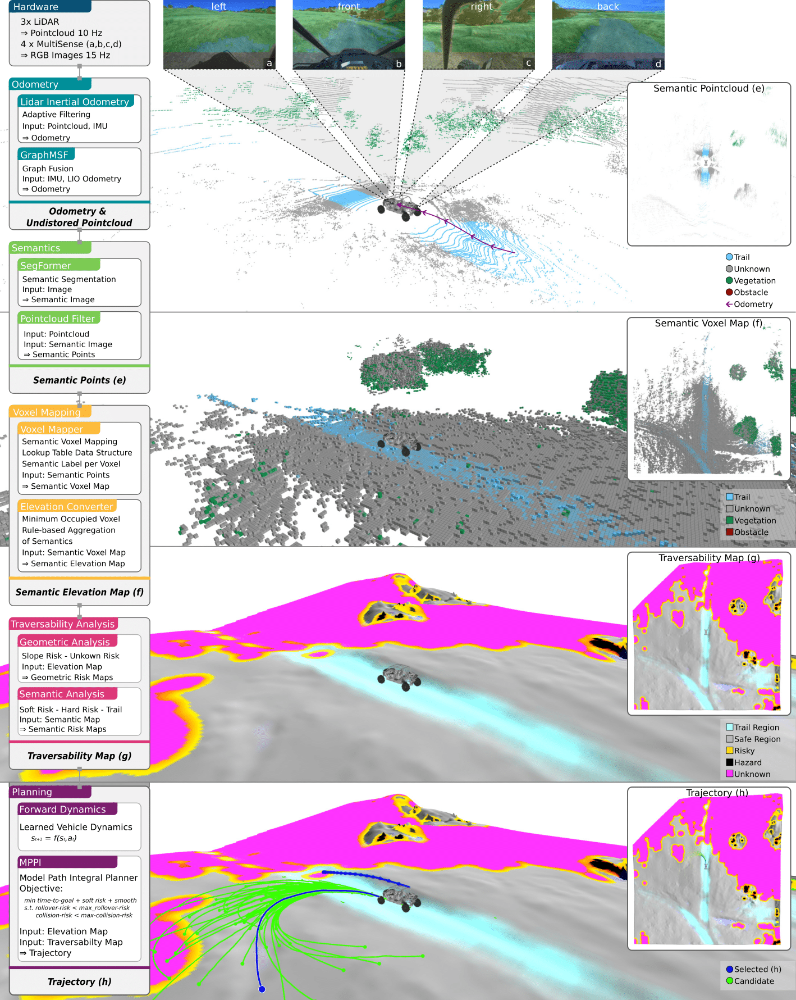
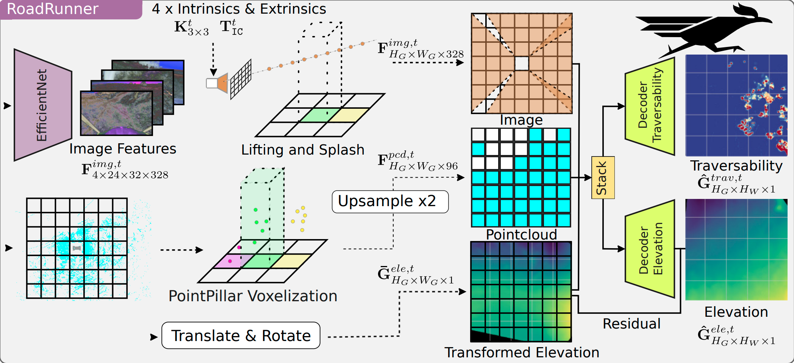
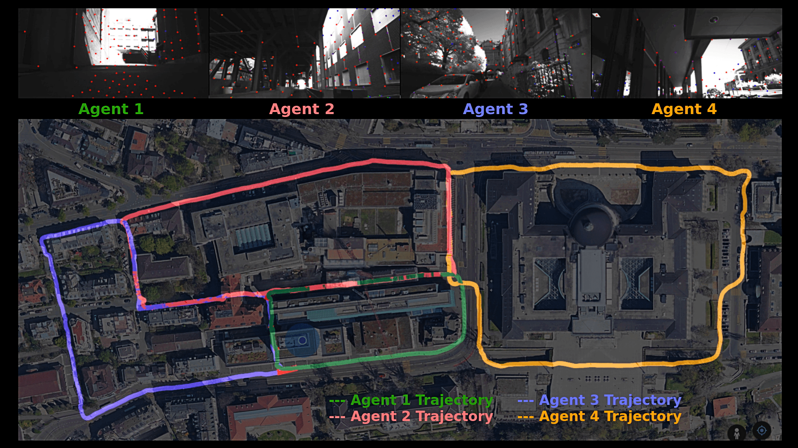
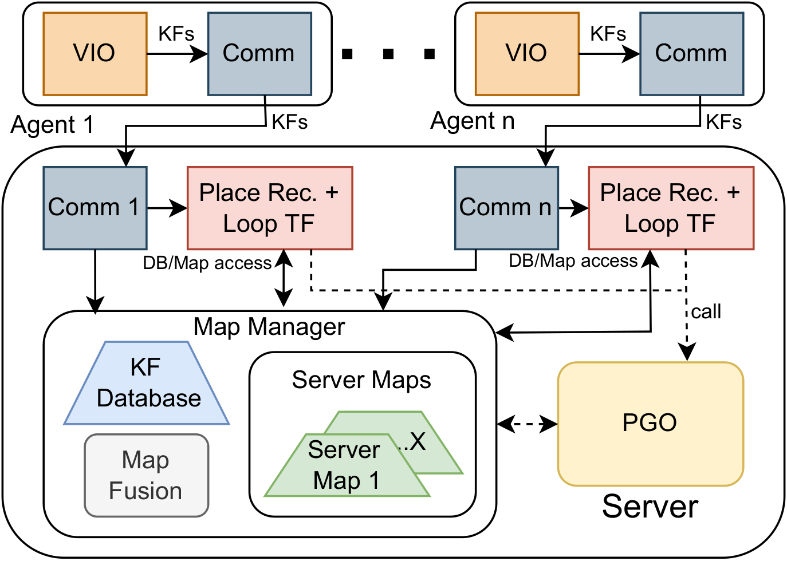
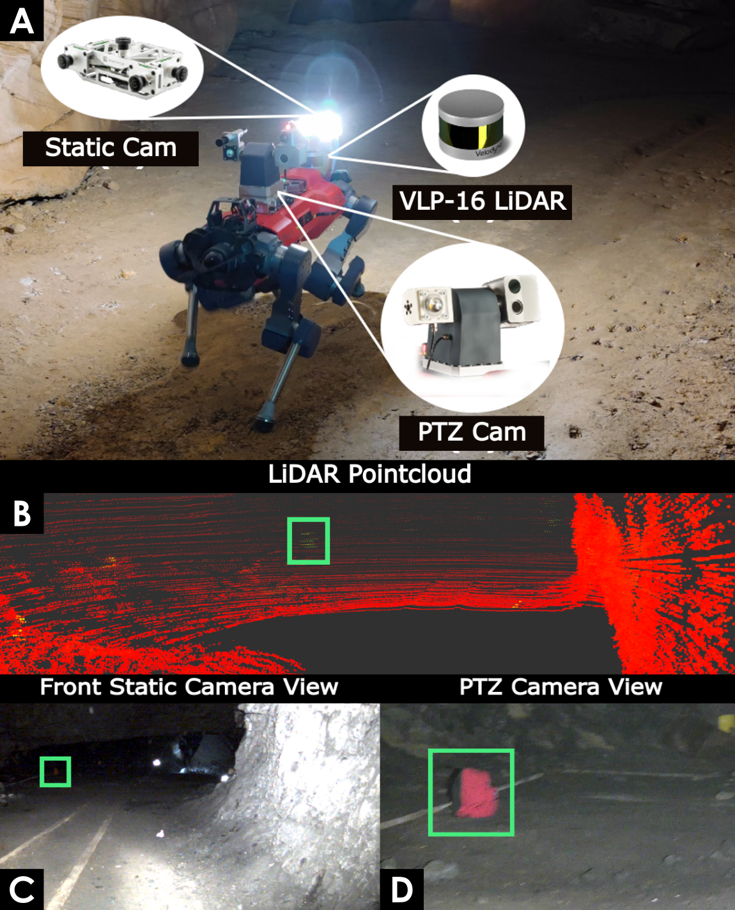
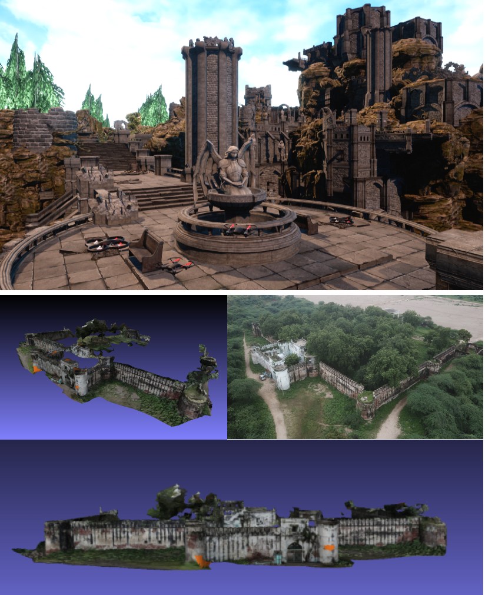

<h7></h7>

## About Me {#about}
{::nomarkdown}

{:/}
---
I am a robotics engineer currently working as a <strong>research engineer</strong> at the <strong>Robotic Systems Lab</strong>, ETH Zurich. I obtained my MSc. in <strong>Robotics, Systems and Control</strong> at <strong>ETH Zurich</strong> in 2024. My interests lie in various aspects of field robotics with a particular focus on <strong>perception for robots</strong>. I did my master's thesis at <strong>NASA Jet Propulsion Laboratory (JPL)</strong>, CA, USA working on <strong>traversability mapping</strong> for offroad environments. Prior to this I have worked on projects involving <strong>Neural implicit SLAM, high speed motion estimation, Collaborative Visual Inertial SLAM and Lidar guided Object detection</strong>. I have had the opportunity to work with a diverse range of sensors ranging from dynamic vision sensor (event camera), RGB/RGBD/Stereo cameras to LiDARs and IMUs. I have experience working on different robotic platforms including legged robots (ANYmal C, D), wheeled ground robots (Polaris RZR Dune Buggy, SuperMegaBot, Clearpath Husky UGV) and flying robots (quadcopters, hexacopters). 

{::nomarkdown}

{:/}

## Work Experience
---

  

    
2024 - Present

  

  

     
<strong>Robotic Systems Lab, ETH Zurich, Switzerland</strong> Robotics Research Engineer 
     <b>Projects:</b> Long-range autonomous hiking with ANYmal,  Large-scale synthetic perception dataset for ground robots

  

## Education
---

  

    
2021 - 2024

  

  

     
<strong>ETH Zurich, Switzerland</strong> Master of Science (MSc.) in Robotics, Systems, and Control

  

  

    
2017 - 2021

  

  

     
<strong>Indian Institute of Technology Kharagpur, India</strong> Bachelor of Technology (B.Tech.) in Mechanical Engineer with Micro-specialisation in Entrepreneurship and Innovation

  

## Internships
---

  

    
Sep 2023  - Apr 2024 

  

  

     
<strong>Perception Systems (347J), NASA Jet Propulsion Laboratory, Pasadena, USA</strong> Master's Thesis  <b>Project:</b> Bird's Eye View Learning for Traversability Mapping of Offroad Environments

  

  

    
Sep 2022 - Feb 2023 

  

  

     
<strong>Sony RDC, Zurich. Switzerland</strong> Computer Vision Intern <b>Project:</b> High Speed Motion Estimation using Event-based Vision

  

  

    
May 2020  - Apr 2021 

  

  

     
<strong>Robot Perception Group, Max Planck Institute for Intelligent Systems, Germany</strong> Bachelor's Thesis (Remote) <b>Project:</b> Mapping of Archaeological Sites using UAVs

  

## Teaching
---

  

    
Mar 2023 - Jul 2023 

  

  

    
<strong>Teaching Assistant, Robotics Summer School, ETH Zurich</strong> Teaching assistant for the annual <a href="https://robotics-summerschool.ethz.ch/" target="_blank">Robotics Summer School</a> organized by RobotX

  

## Research {#publications}
---

  <!-- Left side with image -->
  

    
    
  

  <!-- Right side with details -->
    <!-- Right side with details -->
  

    <!-- Title -->
    <h4 style="margin: 0;">RoadRunner M&M -- Learning Multi-range Multi-resolution Traversability Maps for Autonomous Off-road Navigation</h4>

    <!-- Authors -->
    
<i><u>Manthan Patel</u>, Jonas Frey, Deegan Atha, Patrick Spieler, Marco Hutter, Shehryar Khattak </i>

    <!-- Conference Name -->
    
IEEE RA-L 2024

    <!-- Abstract -->
    

    Autonomous robot navigation in off-road environments requires a comprehensive understanding of the terrain geometry and traversability. The degraded perceptual conditions and sparse geometric information at longer ranges make the problem challenging especially when driving at high speeds. Furthermore, the sensing-to-mapping latency and the look-ahead map range can limit the maximum speed of the vehicle. Building on top of the recent work RoadRunner, in this work, we address the challenge of long-range (100 m) traversability estimation. Our RoadRunner (M&M) is an end-to-end learning-based framework that directly predicts the traversability and elevation maps at multiple ranges (50 m, 100 m) and resolutions (0.2 m, 0.8 m) taking as input multiple images and a LiDAR voxel map. Our method is trained in a self-supervised manner by leveraging the dense supervision signal generated by fusing predictions from an existing traversability estimation stack (X-Racer) in hindsight and satellite Digital Elevation Maps. RoadRunner M&M achieves a significant improvement of up to 50% for elevation mapping and 30% for traversability estimation over RoadRunner, and is able to predict in 30% more regions compared to X-Racer while achieving real-time performance. Experiments on various out-of-distribution datasets also demonstrate that our data-driven approach starts to generalize to novel unstructured environments. We integrate our proposed framework in closed-loop with the path planner to demonstrate autonomous high-speed off-road robotic navigation in challenging real-world environments. 

    

    

    <!-- Links -->
    

  <a href="https://arxiv.org/abs/2409.10940" style="text-decoration: none; color: #0366d6;">[Arxiv]</a> |
  <a href="https://arxiv.org/pdf/2409.10940.pdf" style="text-decoration: none; color: #0366d6;">[Paper]</a>
  <a href="https://leggedrobotics.github.io/roadrunner_mm/" style="text-decoration: none; color: #0366d6;">[Project Page]</a>
  

  

  <!-- Left side with image -->
  

    
    
  

  <!-- Right side with details -->
    <!-- Right side with details -->
  

    <!-- Title -->
    <h4 style="margin: 0;">GlORIE-SLAM: Globally Optimized RGB-only Implicit Encoding Point Cloud SLAM</h4>

    <!-- Authors -->
    
<i>Ganlin Zhang*, Erik Sandström*, Youmin Zhang, <u>Manthan Patel</u>, Luc Van Gool, Martin R. Oswald </i>

    <!-- Conference Name -->
    
Under review for IEEE RA-L

    <!-- Abstract -->
    

    Recent advancements in RGB-only dense Simultaneous Localization and Mapping (SLAM) have predominantly utilized grid-based neural implicit encodings and/or struggle to efficiently realize global map and pose consistency. To this end, we propose an efficient RGB-only dense SLAM system using a flexible neural point cloud scene representation that adapts to keyframe poses and depth updates, without needing costly backpropagation. Another critical challenge of RGB-only SLAM is the lack of geometric priors. To alleviate this issue, with the aid of a monocular depth estimator, we introduce a novel DSPO layer for bundle adjustment which optimizes the pose and depth of keyframes along with the scale of the monocular depth. Finally, our system benefits from loop closure and online global bundle adjustment and performs either better or competitive to existing dense neural RGB SLAM methods in tracking, mapping and rendering accuracy on the Replica, TUM-RGBD and ScanNet datasets.

    

    

    <!-- Links -->
    

  <a href="https://arxiv.org/abs/2403.19549" style="text-decoration: none; color: #0366d6;">[Arxiv]</a> |
  <a href="https://arxiv.org/pdf/2403.19549" style="text-decoration: none; color: #0366d6;">[Paper]</a>
  <a href="https://ganlinzhang.xyz/GlORIE-SLAM/" style="text-decoration: none; color: #0366d6;">[Project Page]</a>
  

  

  <!-- Left side with image -->
  

    
    
  

  <!-- Right side with details -->
    <!-- Right side with details -->
  

    <!-- Title -->
    <h4 style="margin: 0;">RoadRunner - Learning Traversability Estimation for Autonomous Off-road Driving</h4>

    <!-- Authors -->
    
<i>Jonas Frey, <u>Manthan Patel</u>,  D Atha, J Nubert, D Fan, A Agha, C Padgett, M Hutter, P Spieler, S Khattak</i>

    <!-- Conference Name -->
    
IEEE Transactions on Field Robotics (T-FR)

    <!-- Abstract -->
    

    Autonomous navigation at high speeds in off-road environments necessitates robots to comprehensively understand their surroundings using onboard sensing only. The extreme conditions posed by the off-road setting can cause degraded camera image quality due to poor lighting and motion blur, as well as limited sparse geometric information available from LiDAR sensing when driving at high speeds. In this work, we present RoadRunner, a novel framework capable of predicting terrain traversability and an elevation map directly from camera and LiDAR sensor inputs. RoadRunner enables reliable autonomous navigation, by fusing sensory information, handling of uncertainty, and generation of contextually informed predictions about the geometry and traversability of the terrain while operating at low latency. In contrast to existing methods relying on classifying handcrafted semantic classes and using heuristics to predict traversability costs, our method is trained end-to-end in a self-supervised fashion. The RoadRunner network architecture builds upon popular sensor fusion network architectures from the autonomous driving domain, which embed LiDAR and camera information into a common Bird's Eye View perspective. Training is enabled by utilizing an existing traversability estimation stack to generate training data in hindsight in a scalable manner from real-world off-road driving datasets. Furthermore, RoadRunner improves the system latency by a factor of roughly 4, from 500 ms to 140 ms, while improving the accuracy for traversability costs and elevation map predictions. We demonstrate the effectiveness of RoadRunner in enabling safe and reliable off-road navigation at high speeds in multiple real-world driving scenarios through unstructured desert environments.

    

    

    <!-- Links -->
    

  <a href="https://arxiv.org/abs/2402.19341" style="text-decoration: none; color: #0366d6;">[Arxiv]</a> |
  <a href="https://arxiv.org/abs/2402.19341.pdf" style="text-decoration: none; color: #0366d6;">[Paper]</a>
  

  

  <!-- Left side with image -->
  

    
    
  

  <!-- Right side with details -->
    <!-- Right side with details -->
  

    <!-- Title -->
    <h4 style="margin: 0;">COVINS-G: A Generic Back-end for Collaborative Visual-Inertial SLAM</h4>

    <!-- Authors -->
    
<i><u>Manthan Patel</u>, Marco Karrer, Philipp Bänninger, Margarita Chli</i>

    <!-- Conference Name -->
    
International Conference on Robotics and Automation (ICRA), 2023

    <!-- Abstract -->
    

    Collaborative SLAM is essential for multi-robot systems, enabling co-localization in a common reference frame crucial for coordination. Traditionally, a centralized architecture uses agents with onboard Visual-Inertial Odometry (VIO), communicating data to a central server for map fusion and optimization. However, this approach's flexibility is constrained by the VIO front-end choice. Our work introduces COVINS-G, a generalized back-end building on <a href="https://arxiv.org/abs/2108.05756" target="_blank">COVINS</a>, making the server compatible with any VIO front-end, including off-the-shelf cameras like Realsense T265. The COVINS-G back-end deploys a multi-camera relative pose estimation algorithm for computing the loop-closure constraints allowing the system to work purely on 2D image data. In the experimental evaluation, we show on-par accuracy with state-of-the-art multi-session and collaborative SLAM systems, while demonstrating the flexibility and generality of our approach by employing different front-ends onboard collaborating agents within the same mission. The COVINS-G codebase, including a generalized ROS-based front-end wrapper, is open-sourced.

    

    

    <!-- Links -->
    

  <a href="https://arxiv.org/abs/2301.07147" style="text-decoration: none; color: #0366d6;">[Arxiv]</a> |
  <a href="https://arxiv.org/abs/2301.07147.pdf" style="text-decoration: none; color: #0366d6;">[Paper]</a> |
  <a href="https://youtu.be/xPjRJjKUmi0?si=Zua5ouuUjN_Bg0uK" style="text-decoration: none; color: #0366d6;">[Presentation]</a> |
  <a href="https://youtu.be/FoJfXCfaYDw?si=XWyvDxcUUuPHoZSZ" style="text-decoration: none; color: #0366d6;">[Experiments]</a> |
  <a href="https://github.com/VIS4ROB-lab/covins" style="text-decoration: none; color: #0366d6;">[GitHub]</a>
  

  

  <!-- Left side with image -->
  

    
  

  <!-- Right side with details -->
    <!-- Right side with details -->
  

    <!-- Title -->
    <h4 style="margin: 0;">LiDAR-guided object search and detection in Subterranean Environments</h4>

    <!-- Authors -->
    
<i><u>Manthan Patel</u>, Gabriel Waibel, Shehryar Khattak, Marco Hutter</i>

    <!-- Conference Name -->
    
IEEE International Symposium on Safety, Security and Rescue Robotics (SSRR) 2022

    <!-- Abstract -->
    

    Detecting objects of interest, such as human survivors, safety equipment, and structure access points, is critical to any search-and-rescue operation. Robots deployed for such time-sensitive efforts rely on their onboard sensors to perform their designated tasks. However, as disaster response operations are predominantly conducted under perceptually degraded conditions, commonly utilized sensors such as visual cameras and LiDARs suffer in terms of performance degradation. In response, this work presents a method that utilizes the complementary nature of vision and depth sensors to leverage multi-modal information to aid object detection at longer distances. In particular, depth and intensity values from sparse LiDAR returns are used to generate proposals for objects present in the environment. These proposals are then utilized by a Pan-Tilt-Zoom (PTZ) camera system to perform a directed search by adjusting its pose and zoom level for performing object detection and classification in difficult environments. The proposed work has been thoroughly verified using an ANYmal quadruped robot in underground settings and on datasets collected during the DARPA Subterranean Challenge finals.

    

    <!-- Links -->
    

  <a href="https://arxiv.org/abs/2210.14997" style="text-decoration: none; color: #0366d6;">[Arxiv]</a> |
  <a href="https://arxiv.org/pdf/2210.14997.pdf" style="text-decoration: none; color: #0366d6;">[Paper]</a>
  

  

  <!-- Left side with image -->
  

    
  

  <!-- Right side with details -->
    <!-- Right side with details -->
  

    <!-- Title -->
    <h4 style="margin: 0;">Collaborative Mapping of Archaeological Sites using multiple UAVs</h4>

    <!-- Authors -->
    
<i><u>Manthan Patel</u>, Aditya Bandopadhyay, Aamir Ahmad</i>

    <!-- Conference Name -->
    
International Conference on Intelligent Autonomous Systems (IAS 16), 2021

    <!-- Abstract -->
    

    UAVs have found an important application in archaeological mapping. Majority of the existing methods employ an offline method to process the data collected from an archaeological site. They are time-consuming and computationally expensive. In this paper, we present a multi-UAV approach for faster mapping of archaeological sites. Employing a team of UAVs not only reduces the mapping time by distribution of coverage area, but also improves the map accuracy by exchange of information. Through extensive experiments in a realistic simulation (AirSim), we demonstrate the advantages of using a collaborative mapping approach. We then create the first 3D map of the Sadra Fort, a 15th Century Fort located in Gujarat, India using our proposed method. Additionally, we present two novel archaeological datasets recorded in both simulation and real-world to facilitate research on collaborative archaeological mapping. For the benefit of the community, we make the AirSim simulation environment, as well as the datasets publicly available.

    

    <!-- Links -->
    

  <a href="https://arxiv.org/abs/2105.07644" style="text-decoration: none; color: #0366d6;">[Arxiv]</a> |
  <a href="https://arxiv.org/abs/2105.07644.pdf" style="text-decoration: none; color: #0366d6;">[Paper]</a> |
  <a href="https://patelmanthan.in/castle-ruins-airsim/" style="text-decoration: none; color: #0366d6;">[Webpage]</a>
  <a href="https://patelmanthan.in/wp-content/uploads/2020/07/final_BTP_17ME10078.pdf" style="text-decoration: none; color: #0366d6;">[Extended Thesis]</a>

  

  

## Course Projects {#projects}
---

  <strong>3D Vision:</strong> Learning-based methods for the task of reassembly of 3D fractured objects
  <a href="https://github.com/alexandrumeterez/3d-fracture-reassembly" style="text-decoration: none; color: #0366d6;">[Link]</a>
   

  <strong>Deep Learning for Autonomous Driving:</strong> Projects on Multi-task Learning (Semantic Segmentation, Monocular Depth Estimation) and 3D Object Detection using LiDAR data
   

  <strong>Vision Algorithms for Mobile Robotics:</strong> Implemented a Visual Odometry pipeline from scratch in MATLAB along with local Bundle Adjustment and evaluated the pipeline on 3 different datasets.
  <a href="https://github.com/manthan99/VAMR_project" style="text-decoration: none; color: #0366d6;">[Link]</a>
   

  <strong>Planning and Decision Making for Autonomous Robots:</strong> Implemented an RRT-based global planner and MPC-based trajectory tracking for navigation of a spaceship in simulation.
  <a href="https://github.com/shobhit55/padm4ar_final21" style="text-decoration: none; color: #0366d6;">[Link]</a>
   

  <strong>Probabilistic Artificial Intelligence:</strong> Projects on: 1) Bayesian Neural Network for classification on MNIST dataset, 2) Constrained Bayesian Optimization using Expected Improvement as the Acquisition function, 3) Advantage Actor Critic method for learning policy to land spaceship in a simulation environment

## Awards and Achievements {#awards}
---

  <!-- Left side with month and year -->
  

    
Sep 2023 - Apr 2024

  

  <!-- Right side with title and description -->
  

    <!-- Title -->
    <h3 style="margin: 0; font-size: 16px;">JPL Visiting Student Research Program</h3>
    <!-- Description -->
    
JPL Visiting Student Research Fellow for conducting my master's thesis at NASA JPL, Pasadena, CA

  

  <!-- Left side with month and year -->
  

    
Sep 2021 - Mar 2023

  

  <!-- Right side with title and description -->
  

    <!-- Title -->
    <h3 style="margin: 0; font-size: 16px;">ETH D-Mavt Scholarship</h3>
    <!-- Description -->
    
Full, merit-based scholarship awarded to less than 2.5% of all D-Mavt Masters students at ETH Zurich

  

  <!-- Left side with month and year -->
  

    
Dec 2021

  

  <!-- Right side with title and description -->
  

    <!-- Title -->
    <h3 style="margin: 0; font-size: 16px;">Dr. B C Roy Memorial Gold Medal</h3>
    <!-- Description -->
    
Adjudged best all-rounder (Academic and extra-curriculars) among all graduating (1400) B.Tech students at IIT Kharagpur

  

  <!-- Left side with month and year -->
  

    
Dec 2021

  

  <!-- Right side with title and description -->
  

    <!-- Title -->
    <h3 style="margin: 0; font-size: 16px;">Institute Silver Medal (Academic Rank 1)</h3>
    <!-- Description -->
    
Highest Cumulative Grade in Mechanical Engineering among all graduating B.Tech students at IIT Kharagpur

  

  <!-- Left side with month and year -->
  

    
Apr 2020 - Dec 2020

  

  <!-- Right side with title and description -->
  

    <!-- Title -->
    <h3 style="margin: 0; font-size: 16px;">DAAD WISE Scholarship</h3>
    <!-- Description -->
    
Recipient of the prestigious scholarship to perform a research internship at a German Research Institute (MPI-IS)

  

  <!-- Left side with month and year -->
  

    
2018 - 2020

  

  <!-- Right side with title and description -->
  

    <!-- Title -->
    <h3 style="margin: 0; font-size: 16px;">Inter-IIT Tech Meet 7.0, 8.0 and 9.0</h3>
    <!-- Description -->
    
Represented IIT Kharagpur three consecutive times in Inter-IIT Tech events for problem statements invovling autonomous agricultural robot, multi-UAV search mission and UAV-based Sub-terranean exploration mission.  Results: Second Runner Up (2018), First Runner Up (2019) and Winner (2020)

  

  <!-- Left side with month and year -->
  

    
Oct 2020

  

  <!-- Right side with title and description -->
  

    <!-- Title -->
    <h3 style="margin: 0; font-size: 16px;">OP Jindal Engineering and Management Scholarship</h3>
    <!-- Description -->
    
Recipient of the scholarship awarded to 100 students across India for academic and leadership excellence

  

  <!-- Left side with month and year -->
  

    
Jun 2019

  

  <!-- Right side with title and description -->
  

    <!-- Title -->
    <h3 style="margin: 0; font-size: 16px;">27th Intelligent Ground Vehicle Competition (IGVC) </h3>
    <!-- Description -->
    
Secured the second position in the AutoNav Challenge among 40+ participating international teams at Michigan, USA

  

